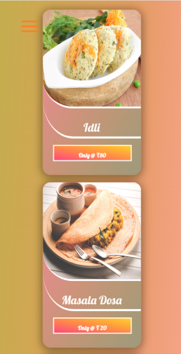

# Project Virtual Kitchen
This is a very simple virtual kitchen responsive single page website built with purely HTML,CSS & Js.
# Quick Demo
1. **Web version**

    
    
    
    

2. **Mobile version**

    
    
    
    


# Project Summary
It is a responsive single page static website build with pure CSS,HTML and JS.Its food section contains flipping food cards which displays the secrets behind the preparation of those recipe.

# Running this project
1. Clone the repo
    ```
    https://github.com/mohini-chauhan/virtual-kitchen.git
    ```
2. Run project
    ```
    open kitchen.html in browser
    ```
    

